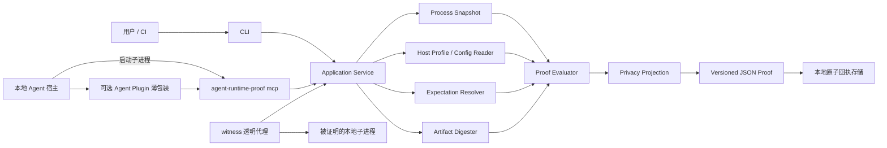

# Agent Runtime Proof 架构、开发与验收设计

- 更新日期：2026-08-25
- 状态：Phase 0 已完成；Phase 1A macOS 主线候选与 Windows Phase 1 核心门已通过各自实机验收，完整 Phase 1 尚未完成
- Phase 0 验收记录：[phase0-acceptance.md](phase0-acceptance.md)
- Phase 1A 验收记录：[phase1-macos-acceptance.md](phase1-macos-acceptance.md)
- Windows 核心验收记录：[phase1-windows-acceptance.md](phase1-windows-acceptance.md)
- Phase 1 延后门与问题：[phase1-deferred-gates.md](issues/phase1-deferred-gates.md)
本期唯一开发切口：Agent Runtime Proof（下文简称 ARP）

## 1. 决策摘要

ARP 是一个面向本地 Agent 运行环境的开源取证工具。它回答的不是“磁盘上安装了什么”，而是：

> 当前这台机器上，某个本地 Agent 实际启动了哪个运行时、从哪里启动、它与声明的期望版本或摘要是否一致，以及这个结论由哪些本地证据支撑。

本期采用“一个独立核心，多个薄入口”的方案：

- 一个可独立安装的 `agent-runtime-proof` 跨平台二进制；
- CLI 是人类、脚本和 CI 的直接入口；
- 本地 `stdio` MCP 是所有支持 MCP 的 Agent 的统一入口；
- Agent Plugin 只包装 MCP 配置、Skill 和说明，不承载核心实现；
- 可选 Witness 模式在启动本地子进程前计算摘要，并把启动动作与证据回执绑定；
- Across Agents Assistant（AAA）仅作为通用 MCP 消费者和真实验收基座，不增加专属页面、任务类型或私有协议；
- ARP 不是 Across 的第四个一方托管插件，不改变 Context、Orchestrator、Autopilot 三个现有插件的边界。

实现语言选择 Go。语言兼容基线为 Go 1.26，CI 同时验证仍受支持的 1.26 最新补丁版和 1.27 最新补丁版；发版记录实际构建工具链。MCP 使用官方 Go SDK 的稳定非预发布版本并锁定依赖。

本项目使用独立仓库；建议的公开仓库为：

- 仓库：`fantasyce/agent-runtime-proof`
- 可执行文件：`agent-runtime-proof`
- 许可证：Apache-2.0，以降低被其他开源或商业 Agent 宿主直接集成的阻力

不使用 `arp` 作为正式命令名，避免与 Address Resolution Protocol 混淆。

## 2. 为什么要做

本地 Agent 生态常见一种“看似已经升级、实际仍在跑旧代码”的状态：

- 安装目录已被新版本覆盖，但旧进程仍加载旧版本；
- Agent 配置指向正式安装目录，实际子进程却从开发检出目录启动；
- 同一插件存在多个副本，不同宿主各自启动了不同版本；
- 包清单、版本字符串和磁盘文件一致，但没有证据能绑定到本次实际启动；
- 排查只能靠人工组合进程列表、命令行、配置文件、安装记录和文件摘要，结果不可复用也不可机器判定。

大平台通常能展示“已配置”“已安装”或“进程存在”，但很少给出一个跨宿主、跨语言、可留存且明确披露证据边界的本地运行时证明。ARP 专门处理这件脏活累活，并保持足够小，使大型平台可以把它当作标准工具或库集成。

## 3. 目标、成功定义与非目标

### 3.1 本期目标

1. 在 macOS、Windows 和 Linux 本地环境枚举候选运行时，并使用 `PID + 进程创建时间` 建立稳定进程身份。
2. 将进程、父子关系、启动命令的安全投影、可执行文件或脚本、宿主配置来源、安装来源和期望摘要关联起来。
3. 对声明的文件或目录载荷进行确定性 SHA-256 摘要计算，并检测扫描期间变化。
4. 输出版本化、可机器验证、默认脱敏的 JSON Proof。
5. 给出 `MATCHED`、`STALE`、`LEAKED`、`CONFLICT`、`NOT_RUNNING` 或 `UNKNOWN` 结论，同时独立标注证明强度。
6. 通过 CLI、本地 `stdio` MCP 和可选 Witness 提供同一核心能力。
7. 使用同一 MCP 实现兼容 AAA、Codex、Claude Code、Cursor、OpenCode、DeepSeek Harness、VS Code/GitHub Copilot 等本地宿主；宿主差异只进入可选证据增强层。
8. 建立真实 Windows 发版门槛和 Linux Docker 验收，不把“能编译”冒充“已经支持”。

### 3.2 成功定义

用户能在本地 Agent 中问“当前运行的是不是我刚安装的版本”，Agent 调用 ARP 后得到一份 Proof。Proof 能明确说明：

- 看到了哪个进程；
- 进程如何与期望对象关联；
- 实际核对了哪些字节或声明；
- 为什么得到该结论；
- 哪些信息因权限、竞态或平台限制无法证明；
- 同一输入在 CLI 与 MCP 中具有相同语义。

### 3.3 明确非目标

本期不做以下内容：

- 不服务远端 Agent，不提供 HTTP、SSE、公网或局域网服务端点；
- 不做云端控制面、多租户、账号系统、遥测或 Proof 上传；
- 不声称远程证明、硬件证明、内核级完整性或“每一页已加载内存”的加密证明；
- 不杀进程、不重启宿主、不删除缓存、不修改 Agent 配置、不安装或升级插件、不自动修复；
- 不执行从宿主配置中发现的命令，不加载不可信配置中的代码；
- 不增加 AAA 专属页面、专属任务类型或新的 Across 一方托管插件；
- 不为每个 Agent 重写一套核心逻辑；
- 不把“测试残留清理器”和“哈希安全证据脱敏器”纳入本期实现。

最后两个切口仅保留在第 19 节供后续评估。

## 4. 方案比较

### 4.1 方案 A：Agent Plugin 优先

把核心能力直接写进某一种 Agent Plugin。

优点是单一宿主安装体验短；缺点是核心被特定宿主生命周期和打包格式锁定，其他宿主需要复制实现，也不利于 CI 或平台 SDK 集成。本期不采用。

### 4.2 方案 B：逐宿主适配优先

分别为 Cursor、OpenCode、DeepSeek Harness 等开发专用适配器。

它能读取更多宿主私有状态，但会把维护成本与宿主更新速度绑定，且同一证明语义容易分叉。本期只保留数据驱动的宿主 Profile，不采用多套实现。

### 4.3 方案 C：独立核心 + CLI + stdio MCP + Witness

核心库只处理本地观测、摘要、规则与 Proof；CLI、MCP、Plugin 和嵌入式 SDK 都调用同一应用层。所有支持本地 `stdio` MCP 的 Agent 使用相同服务。宿主 Profile 只负责发现配置来源和补充归因；没有 Profile 时仍可按 PID 或期望文件工作。

这是本期采用方案。它同时满足：

- 小而独立，便于大平台集成；
- 不追随每个宿主的私有产品形态；
- CLI、Agent 和 CI 共享语义；
- 被动观测与协作式启动证明可以逐级增强；
- Across 只作为试验和验收环境，不成为依赖。

## 5. 总体架构



### 5.1 依赖方向

```text
CLI / MCP / Witness / SDK
            ↓
      Application Service
            ↓
Process + Host Profile + Expectation + Artifact + Proof + Privacy + Store
            ↓
  macOS / Windows / Linux OS Adapter
```

规则：

- OS 适配层不能依赖 CLI 或 MCP；
- 宿主 Profile 只能产出候选和来源，不直接决定结论；
- MCP 不拥有第二套模型或业务逻辑；
- Proof 必须先由核心生成，再做渠道投影；
- Witness 不解析、不改写被代理进程的 MCP 帧。

## 6. 产品与仓库边界

ARP 是独立开源项目，可在没有 AAA、没有 Across 三款插件时完整运行。Across 侧只做两件事：

1. 把 ARP 当作普通外部本地 MCP Server 注册并调用；
2. 用 Across 的插件生命周期场景制造“正式副本、旧进程、开发目录泄漏、多版本并存”等真实验收样本。

AAA 不得：

- 导入 ARP 源码；
- 把 ARP 打成第四个一方托管载荷；
- 依赖 AAA 私有 Unix Socket 才能运行 ARP；
- 为 ARP 增加专属结果页或 `if tool == agent-runtime-proof` 分支；
- 把 AAA 的“已安装”状态当作 ARP 的运行时证明。

ARP 也不得依赖 Context、Orchestrator、Autopilot 或 AAA 的私有数据库、配置、凭据和协议。

## 7. 技术栈与依赖策略

### 7.1 语言与二进制

- Go 1.26 作为 `go.mod` 语言兼容基线；
- CI 验证 Go 1.26 最新补丁版和 1.27 最新补丁版；
- 正式发版使用当时仍受支持且已通过矩阵的补丁版本，并写入 `build.toolchain`；
- 通过 `-trimpath` 和可复现构建参数减少开发机路径泄漏；
- 每个平台提供单文件二进制，不要求用户安装 Go、Node 或 Python。

选择 Go 的原因是跨平台单文件分发、成熟的进程与文件系统 API、低启动成本，以及官方 MCP Go SDK 已能直接提供 `stdio` transport。

### 7.2 依赖

- MCP：`github.com/modelcontextprotocol/go-sdk`，实现时锁定最新稳定非预发布版本；
- 通用进程信息：`github.com/shirou/gopsutil/v4`；
- 原生系统调用：Go 标准库、`golang.org/x/sys` 和按平台隔离的最小原生桥接；
- JSON Schema：仓库内版本化 schema 为权威合同；实现不得只依赖 Go struct 隐式行为；
- CLI 参数优先使用标准库；如引入 CLI 框架，必须说明必要性并锁定版本。

不把预发布 MCP SDK、宿主 SDK 或体量较大的运行框架放入 v1 生产依赖。

### 7.3 OS 适配

| 平台 | 主要证据源 | 实现要求 |
| --- | --- | --- |
| macOS | `proc_pidpath`、`proc_pidinfo`、进程创建时间、父子关系、文件 stat | `gopsutil` 在 macOS 不提供完整 `exe` 能力，因此使用 Darwin 原生适配；在 macOS runner 构建，不把跨编译成功当作验证 |
| Windows | `QueryFullProcessImageNameW`、`GetProcessTimes`、进程句柄、文件 ID、Job Object | 使用宽字符 API；访问拒绝转为 `UNKNOWN/INACCESSIBLE`；Witness 用 Job Object 约束自己创建的子进程，不申请管理员权限 |
| Linux | `/proc/<pid>/exe`、`cmdline`、`stat`、boot ID、inode | 正确处理 deleted executable、mount namespace 和 `/proc` 权限；Docker 仅声明容器内本地验证能力 |

## 8. 核心领域模型

### 8.1 ProcessIdentity

PID 会复用，因此任何进程证据必须绑定：

```json
{
  "pid": 4127,
  "created_at_unix_nano": "1787536210123456789",
  "boot_id_hash": "sha256:...",
  "executable_identity": {
    "path_hash": "sha256:...",
    "file_id": "platform-specific-safe-id"
  }
}
```

`pid + created_at` 是最低身份条件；平台能提供时再加入 boot ID、inode 或 Windows File ID。Proof 生成前后必须重新读取身份，发生变化就放弃该样本并返回 `UNKNOWN`，原因码为 `PROCESS_IDENTITY_CHANGED`。

### 8.2 RuntimeExpectation

权威 schema：`agent-runtime-expectation/1.0`。建议字段：

```json
{
  "schema_version": "agent-runtime-expectation/1.0",
  "subject": {
    "id": "com.example.mcp-server",
    "display_name": "Example MCP Server",
    "version": "1.4.2"
  },
  "launch": {
    "kind": "native|interpreter-script|declared-tree",
    "entrypoint": "bin/example-server",
    "argv_prefix": ["serve", "--stdio"]
  },
  "artifact": {
    "root": "/resolved/local/root",
    "include": ["bin/**", "lib/**", "manifest.json"],
    "exclude": ["cache/**", "logs/**"],
    "sha256": "...",
    "max_files": 20000,
    "max_bytes": 268435456
  },
  "policy": {
    "allowed_roots": ["/resolved/local/root"],
    "allow_symlinks": false
  },
  "source": {
    "kind": "release-manifest|installed-record|user-file|host-config",
    "locator_hash": "sha256:...",
    "trust": "verified|declared|untrusted"
  }
}
```

规则：

- 相对路径相对于 expectation 文件所在目录或明确的 `artifact.root` 解析；
- 解析后必须仍在允许根内；
- schema 拒绝未知的安全关键字段，普通扩展字段进入命名空间；
- expectation 自身的来源和信任必须进入 Proof；
- “匹配一个未经验证的 manifest”只证明与该声明一致，不证明供应链可信。

### 8.3 RuntimeCandidate

候选是一次不可变扫描快照，包含：

- ProcessIdentity；
- 安全的可执行文件、脚本和工作目录标识；
- 父进程链的有限摘要；
- 来自 Host Profile 的配置绑定及来源；
- 来自 Witness 的可选启动回执；
- 无法读取的字段和对应原因；
- 快照开始、结束时间与平台。

原始环境变量、完整命令行和文件内容不进入 Candidate 的可序列化公共结构。

### 8.4 RuntimeProof

权威 schema：`agent-runtime-proof/1.0`。顶层至少包含：

```json
{
  "schema_version": "agent-runtime-proof/1.0",
  "proof_id": "sha256:<canonical-proof-digest>",
  "observed_at": "2026-08-24T12:34:56.789Z",
  "tool": {
    "name": "agent-runtime-proof",
    "version": "0.1.0",
    "commit": "...",
    "toolchain": "go1.27.x"
  },
  "platform": {
    "os": "windows|darwin|linux",
    "arch": "amd64|arm64"
  },
  "subject": {},
  "expectation": {},
  "observation": {},
  "host_attribution": {},
  "verdict": "MATCHED",
  "proof_level": "ARTIFACT_OBSERVED",
  "reason_codes": [],
  "evidence": [],
  "privacy": {},
  "limitations": []
}
```

`proof_id` 由去掉 `proof_id` 字段后的 canonical JSON 计算 SHA-256。它提供篡改可见性，不等同于签名、设备身份或远程证明。

## 9. Verdict 与证明等级

结论和证明等级是两个维度，禁止把“结论为 MATCHED”直接翻译成“已证明内存中的全部代码”。

### 9.1 Verdict

| Verdict | 精确定义 |
| --- | --- |
| `MATCHED` | 已观测到的、由当前 proof level 覆盖的身份或载荷与 expectation 一致 |
| `STALE` | 有直接摘要、版本或 Witness 回执证明运行时绑定的是已知旧载荷，而当前 expectation 指向新载荷 |
| `LEAKED` | 已识别为目标 subject 的运行时解析到允许根之外，例如开发检出目录或非托管副本 |
| `CONFLICT` | 同一 binding 下存在多个互不兼容的活跃摘要，或多个同等可信 expectation 无法唯一选择 |
| `NOT_RUNNING` | 在完整且未被权限阻断的目标扫描范围内没有候选进程 |
| `UNKNOWN` | 权限不足、证据不完整、扫描超限、进程竞态、载荷变化或 expectation 缺失，无法安全判定 |

仅凭“进程启动时间早于安装更新时间”不能判为 `STALE`；没有直接旧摘要时必须返回 `UNKNOWN`，并附 `POSSIBLE_STALE_AFTER_REPLACEMENT`。

### 9.2 ProofLevel

从弱到强：

1. `PROCESS_OBSERVED`：只确认进程身份和有限元数据；
2. `CONFIG_BOUND`：进程与本地宿主配置或声明路径有可解释绑定；
3. `ARTIFACT_OBSERVED`：检查时读取到的入口文件或声明载荷摘要与 expectation 比较；
4. `LAUNCH_WITNESSED`：ARP 在创建子进程前摘要载荷，并以 PID、创建时间和命令安全摘要记录启动回执。

`LAUNCH_WITNESSED` 是 v1 最强等级，但只证明“ARP 观察到指定载荷并据此发起了该次本地启动”。它仍不证明动态加载的所有代码、进程运行后未被注入、内核可信或内存页未变化。限制必须原样写入 Proof。

## 10. 确定性摘要算法

### 10.1 文件

- 算法固定为 SHA-256；
- 摘要前后读取大小、修改时间和平台文件身份；
- 读取期间任一身份变化返回 `UNKNOWN/ARTIFACT_CHANGED_DURING_READ`；
- 不跟随 expectation 根之外的符号链接、junction 或 reparse point；
- 无权限读取不降级为版本字符串匹配。

### 10.2 目录载荷

1. 在已解析根内应用 include/exclude；
2. v1 只接受普通文件并拒绝符号链接；链接本身及解析目标尚无冻结的可复算表示，只有后续 schema 版本定义该表示后才能开放；
3. 相对路径转 `/` 分隔符并做 Unicode NFC 归一化；
4. Windows 路径另做大小写碰撞检测；归一化后冲突直接失败；
5. 对每个文件计算 `{path, size, sha256}`；
6. 按归一化路径 UTF-8 字节序排序；
7. 对 canonical JSON 数组计算根 SHA-256；
8. Proof 记录实际文件数、总字节数、耗时、include/exclude 和限制值。

默认上限：20,000 个文件、256 MiB 总读取量、10 秒。达到任一上限返回 `UNKNOWN/ARTIFACT_SCAN_LIMIT_EXCEEDED`，绝不返回部分集合的 `MATCHED`。用户可显式调整上限，调整值必须进入 Proof。

### 10.3 解释器运行时

Python、Node 等场景至少分别记录解释器和入口脚本。只有 expectation 明确声明包树并完成目录摘要时，才能说声明载荷匹配；入口脚本相同不代表所有动态依赖相同。动态加载范围不明时写入 limitation。

## 11. 被动观测与 Witness

### 11.1 被动模式

`inspect` 和 `verify` 对既有进程只读观测。它适合不愿修改启动配置的用户，但受 OS 权限、进程竞态、文件被覆盖和解释器动态加载限制。

### 11.2 Witness 模式

```text
agent-runtime-proof witness [--expectation expectation.json] -- <command> [args...]
```

流程：

1. 解析命令为直接 argv，不经过 shell；
2. 解析 expectation，验证根边界和限制；
3. 对声明载荷计算摘要；
4. 创建子进程并取得 PID 与创建时间；
5. 写入内容寻址的原子 launch receipt；
6. stdin 与 stdout 双向原样转发；
7. 所有 ARP 日志只写 stderr；
8. stdin EOF 时先允许子进程优雅退出，超时后按平台终止 ARP 自己创建的子进程；
9. Unix 转发必要的终止信号并隔离子进程组；Windows 使用 Job Object 确保代理退出不会遗留受管子进程；
10. 记录退出状态，不把诊断字符写入协议 stdout。

没有 expectation 时 Witness 可以产生 observation-only 回执，但不能给出 `MATCHED`。对于 MCP Server，代理必须通过字节透明测试：同一输入帧经直连与 Witness 的输出帧逐字节一致，stderr 除外。

大型宿主若不希望多一层代理，可以嵌入核心 SDK，在自己的启动器中调用同一 `PrepareLaunch → Spawned` 回执接口；语义和 schema 不变。

## 12. CLI 合同

```text
agent-runtime-proof inspect [--pid PID | --all | --binding ID] [--format table|json]
agent-runtime-proof verify --expectation FILE [--pid PID | --binding ID] [--format table|json]
agent-runtime-proof witness [--expectation FILE] -- COMMAND [ARG...]
agent-runtime-proof doctor [--host HOST_ID] [--format table|json]
agent-runtime-proof mcp
```

行为要求：

- `inspect` 不带目标时只显示安全的本用户候选，不进行无界目录摘要；
- `verify` 必须有 expectation，负面结论仍输出完整 Proof；
- `doctor` 只检查可读性、宿主 Profile、配置引用和 MCP 启动条件，只打印建议，不写配置；
- `mcp` 只启动本地 stdio 服务，不监听端口；
- `--format json` 的 stdout 只允许一个完整 JSON 结果；诊断进入 stderr；
- MCP 和 Witness 模式的 stdout 永远只承载协议数据。

退出码：

| Code | 含义 |
| --- | --- |
| 0 | `MATCHED`，或 inspect/doctor 正常完成 |
| 2 | 已判定的负面结论：`STALE`、`LEAKED`、`CONFLICT`、verify 下的 `NOT_RUNNING` |
| 3 | `UNKNOWN` 或 `INACCESSIBLE` 等不可判定结果 |
| 64 | 参数或 expectation 无效 |
| 70 | 未被领域错误覆盖的内部故障 |

批量结果的退出码取最严重项：内部故障 > 无效输入 > 不可判定 > 负面结论 > 成功；JSON 中仍保留每项独立 verdict。

## 13. MCP 合同

本期只提供本地 `stdio` transport，并暴露三个只读工具：

### 13.1 `list_local_runtime_candidates`

用途：列出安全投影后的本地候选，不做昂贵载荷摘要。

- 输入：可选 `host_id`、`binding_id`、`limit`。
- 输出：Candidate 摘要、未访问字段和扫描限制。

### 13.2 `inspect_local_runtimes`

用途：对 PID、binding 或允许范围做本地观测，输出一个或多个 observation proof。

- 输入：`pid`、`binding_id` 或明确的扫描选择；三者不得含糊。
- 输出：`agent-runtime-proof/1.0` 数组。

### 13.3 `verify_local_runtime`

用途：使用 expectation 对本地运行时判定。

- 输入：经过 schema 校验的 expectation 对象，或位于允许本地路径中的 expectation 文件；可选 PID/binding。
- 输出：完整 Proof 与 verdict。

要求：

- 三个工具都标记 read-only，不声明 destructive 或 open-world 能力；
- `UNKNOWN`、`STALE` 等是成功的工具结果，不是 JSON-RPC transport error；
- 只有参数/schema 错误、协议故障或内部崩溃使用 MCP error；
- 不把 MCP `clientInfo` 当作可信宿主身份，只作为归因提示；
- tool schema、CLI schema 和落盘 schema 从同一版本化定义生成或一致性测试；
- 服务支持当前锁定 SDK 的稳定 MCP 版本协商，并至少回归仍被 SDK 支持的上一代客户端；
- 连接关闭或 stdin EOF 后及时退出，不遗留进程和临时文件。

## 14. 宿主兼容策略

### 14.1 通用层

只要本地 Agent 能启动一个 `stdio` MCP Server，就能使用完整 verify 能力。核心判断不依赖宿主名称。

标准配置的本质始终相同：

```json
{
  "command": "agent-runtime-proof",
  "args": ["mcp"]
}
```

仓库提供各宿主的示例片段和手工配置说明，但 v1 不自动写入这些配置。

### 14.2 Host Profile 增强层

Profile 是经过版本控制的数据与解析器组合，包含：

- `host_id` 和支持的平台；
- 进程名称/签名的保守匹配器；
- 公开、稳定的配置文件候选位置；
- 只读 JSON/TOML/YAML 字段映射；
- 如何从本地 MCP 配置生成 binding；
- 哪些字段可能含秘密，必须丢弃或哈希；
- fixture 版本与来源。

Profile 不得执行配置中的命令、shell 插值、插件代码或动态表达式。解析失败只影响增强证据，不得破坏 PID/expectation 的通用验证。

### 14.3 v1 真实兼容目标

| 宿主 | v1 接入方式 | 专用实现 |
| --- | --- | --- |
| AAA | 通用本地 MCP 注册 | 无；只验证通用能力边界 |
| Codex | 本地 stdio MCP | 可选 Profile，仅增强配置来源 |
| Claude Code | 本地 stdio MCP | 可选 Profile，仅增强配置来源 |
| Cursor | 本地 stdio MCP | 可选 Profile，仅增强配置来源 |
| OpenCode | 本地 stdio MCP | 可选 Profile，仅增强配置来源 |
| DeepSeek Harness | `@deepseek-ai/dsh-mcp-client` 的 stdio 配置 | 可选 Cordis Profile，仅增强配置来源 |
| VS Code/GitHub Copilot | 本地 stdio MCP | 可选 Profile，仅增强配置来源 |
| 其他 MCP Host | 相同 stdio 命令 | 无 Profile 也必须可验证显式 PID/expectation |

如果某个具体宿主版本没有本地 stdio MCP 能力，验收必须记录为“宿主能力缺失”，不能临时扩展网络传输，也不能声称兼容。升级该宿主或等待其公开能力属于外部依赖。

## 15. 隐私、安全与威胁模型

### 15.1 默认最小披露

Proof、CLI JSON、MCP 返回和本地回执默认不得包含：

- 原始环境变量值；
- 完整 argv；
- 文件内容；
- 对话或工具 transcript；
- 用户名、主目录绝对路径和私有仓库绝对路径；
- token、cookie、密码、私钥或可恢复凭据。

公开投影使用安全 basename、`$HOME` 占位和带域分隔的 SHA-256 路径/参数摘要。CLI 只有在交互终端并显式传入 `--show-local-paths` 时才可显示本机路径；MCP 永远不接受此开关。

### 15.2 主要威胁与对策

| 威胁 | 对策 |
| --- | --- |
| PID 复用 | PID + 创建时间；判定前后复核 |
| TOCTOU / 扫描中替换 | 文件身份与 stat 前后检查；变化即 UNKNOWN |
| symlink/junction 逃逸 | 默认拒绝；解析后重复检查允许根；检测归一化碰撞 |
| 恶意超大目录 | 文件数、字节数和时间硬上限；超限不部分通过 |
| 配置注入 | 只用无执行解析器；不展开 shell、不求值 JS/YAML tag、不运行命令 |
| 命令行含秘密 | 不持久化完整 argv；仅保存允许前缀和分段摘要 |
| 权限提升诱导 | 从不申请管理员/root；访问拒绝显式 UNKNOWN |
| Proof 被修改 | canonical JSON digest；明确它不是签名 |
| expectation 被伪造 | 记录来源和 trust；不把 untrusted match 提升为供应链验证 |
| Witness 污染 MCP stdout | stdout 零日志规则、字节透明黄金测试、stderr 专用 |
| 子进程泄漏 | Unix 受管进程组、Windows Job Object、EOF/超时退出测试 |
| 配置扫描越界 | 仅访问内置 Profile 声明位置或用户显式路径；拒绝任意全盘搜索 |

### 15.3 只读边界

ARP 对宿主与目标状态严格只读。唯一允许写入的是 ARP 自己的有界状态：

- Witness launch receipt；
- 内容寻址 Proof（用户显式要求保存时）；
- 临时原子写文件。

它不得修改 Agent 配置、目标安装目录、进程、网络、系统权限或 Across 正式状态。

## 16. 本地存储与清理

默认路径遵循 Across 的本地产品布局，但 ARP 仍可独立运行：

```text
~/.across/data/agent-runtime-proof/proofs/
~/.across/data/agent-runtime-proof/launch-receipts/
~/.across/run/agent-runtime-proof/
```

Windows 将 `~` 解析为当前用户 Profile；路径语义保持一致。后续可通过 `AGENT_RUNTIME_PROOF_HOME` 覆盖测试根，禁止复用 `HOME`。

规则：

- 无常驻 daemon；
- Proof/receipt 使用临时文件、flush/fsync、原子 rename；
- 文件名使用内容摘要，不接受用户输入直接拼路径；
- 默认只在 Witness 或 `--save` 时落盘；普通 MCP 调用不长期保存；
- 提供仅针对 ARP 自有过期状态的有界清理策略，但 v1 不提供删除宿主缓存或安装副本的能力；
- 自动测试必须使用任务专属 home，结束后验证零残留。

## 17. 建议仓库结构

```text
agent-runtime-proof/
├── cmd/agent-runtime-proof/main.go
├── internal/
│   ├── app/
│   ├── artifact/
│   ├── cli/
│   ├── expectation/
│   ├── hostprofile/
│   ├── mcpserver/
│   ├── privacy/
│   ├── process/
│   │   ├── darwin/
│   │   ├── linux/
│   │   └── windows/
│   ├── proof/
│   ├── store/
│   └── witness/
├── schemas/
│   ├── agent-runtime-expectation-1.0.schema.json
│   └── agent-runtime-proof-1.0.schema.json
├── plugin/agent-runtime-proof/
│   ├── .codex-plugin/plugin.json
│   ├── .mcp.json
│   └── skills/agent-runtime-proof/SKILL.md
├── testdata/
│   ├── hosts/
│   └── scenarios/
├── docs/
│   ├── proof-contract.md
│   ├── threat-model.md
│   └── host-configuration.md
├── scripts/
├── .github/workflows/
├── LICENSE
├── SECURITY.md
└── README.md
```

Agent Plugin 必须保持薄：manifest、Skill 和 `.mcp.json` 只调用 PATH 中的 `agent-runtime-proof mcp`。Plugin 不内嵌另一份核心逻辑，也不偷偷下载二进制。

## 18. 开发计划

### Phase 0：合同与威胁模型

交付：

- expectation/proof JSON Schema；
- verdict、proof level、reason code 注册表；
- canonical JSON 与目录摘要规范；
- 隐私字段分级和威胁模型；
- 跨平台 fixture 格式。

完成门槛：schema 黄金样本、兼容性和拒绝样本全部通过；不存在未定义的安全关键语义。

### Phase 1：核心 CLI 与三平台进程观测

交付：

- `inspect`、`verify`、`doctor`；
- macOS、Windows、Linux ProcessIdentity；
- 文件/目录摘要与 expectation resolver；
- Proof 生成、脱敏和退出码。

完成门槛：三平台自动矩阵通过；macOS 和 Windows 有真实本机进程证据，Linux 有容器内真实进程证据。

### Phase 2：本地 stdio MCP

交付：

- 三个只读 MCP tools；
- 协议协商、取消、EOF 和并发处理；
- Agent Plugin 薄包装；
- 通用配置文档。

完成门槛：官方 MCP Inspector/SDK fixture 通过，stdout 零污染，至少一个非 Across Agent 完成真实调用。

### Phase 3：Witness

交付：

- 跨平台透明代理；
- launch receipt；
- Unix 信号/进程组和 Windows Job Object 生命周期；
- SDK 嵌入接口。

完成门槛：协议字节透明、正常/异常退出、父进程被杀和超时升级测试全部通过，无子进程和状态残留。

### Phase 4：宿主 Profile 与真实矩阵

交付：

- AAA、Codex、Claude Code、Cursor、OpenCode、DeepSeek Harness、VS Code/Copilot Profile 或配置 fixture；
- 各宿主的人工配置与验证说明；
- Windows 真实主机回归记录；
- Linux Docker 验收记录。

完成门槛：每个命名宿主至少在一个正式支持平台完成真实 stdio MCP 调用；所有宿主共享同一二进制和工具合同。

### Phase 5：开源发版

交付：

- 安全检查、SBOM、provenance/attestation；
- 每平台二进制、源码包和 SHA256SUMS；
- 安装、升级、降级、卸载和干净环境文档；
- AAA 通用集成终验。

完成门槛：第 19 节全部必选门通过，tag 指向 `origin/main`，公开资产不含秘密、开发机绝对路径、构建缓存或测试内容。

## 19. 验收标准与发版门槛

### 19.1 证据阶梯

任何“完成”结论必须逐层成立：

```text
source
  → release asset
  → installed binary
  → live OS process
  → local stdio MCP
  → real Agent host
  → AAA generic integration
```

低层通过不能替代高层验收。每层必须记录版本、提交、平台、时间、命令/操作、结果和未覆盖项。

### 19.2 必选自动测试

#### 领域与 schema

- expectation/proof 正反 JSON Schema 样本；
- canonical JSON 在字段顺序变化后摘要不变；
- 未知安全字段、路径逃逸、归一化碰撞被拒绝；
- reason code 与 verdict/proof level 组合合法性；
- 旧 minor schema 的兼容读取与新字段忽略策略；
- Proof 自摘要可复算，修改任一受保护字段后失败。

#### 进程与载荷场景

- 正在运行的当前版本：`MATCHED`；
- 安装更新后仍运行的旧版本：有直接旧摘要时 `STALE`；
- 只有时间顺序、没有旧摘要：`UNKNOWN/POSSIBLE_STALE_AFTER_REPLACEMENT`；
- 同一 binding 的两个不同摘要：`CONFLICT`；
- 从允许根外开发检出目录启动：`LEAKED`；
- 原生二进制；
- 解释器 + 入口脚本 + 声明目录树；
- 进程文件在扫描中改变：`UNKNOWN`；
- wrapper/父子进程与 orphan 场景；
- PID 复用或创建时间变化；
- symlink、Windows junction/reparse point 和根目录逃逸；
- 路径含空格、中文和 Unicode 归一化差异；
- 权限拒绝；
- argv 和环境含伪造 secret 前缀，输出中不得出现原文；
- 超大目录触发上限，不能部分 `MATCHED`；
- expectation 缺失或来源不可信；
- 正常和异常退出后零测试残留。

#### Witness 与 MCP

- 直连与 Witness 下 MCP 请求/响应 stdout 逐字节一致；
- stderr 日志不进入 stdout；
- stdin EOF、取消、SIGTERM/强制终止和 Windows Job Object 回收；
- 并发工具调用使用不可变扫描快照，不交叉污染；
- `UNKNOWN` 等领域结果不错误映射为 transport error；
- MCP 旧客户端协商和当前稳定协议回归；
- malformed JSON-RPC、超大输入和取消不会导致进程泄漏。

### 19.3 平台矩阵

| 平台 | v1 支持级别 | 必须完成的证据 |
| --- | --- | --- |
| macOS 14+ arm64 | 正式支持 | 原生构建、安装二进制、真实进程、CLI、stdio MCP、Witness、真实 Agent、AAA 通用集成 |
| Windows 11 amd64 | 正式支持 | 原生构建、安装二进制、真实进程、CLI、stdio MCP、Witness、至少三个真实 Agent Host |
| Linux amd64 / Ubuntu LTS 容器 | 正式支持核心与 CLI/MCP | Docker 内真实进程、CLI、stdio MCP、Witness、通用 Host fixture；不宣称 Linux 桌面 UI 验收 |
| macOS amd64、Windows arm64、Linux arm64 | 初始构建支持 | 编译、schema 和最小 smoke；没有真实硬件前不得宣传为正式验收平台 |

Windows 真实回归是 v1 发版硬门。如果尚未获得 Windows 主机权限，状态必须是“外部依赖未满足/发版阻塞”，不能记为 skip 或由交叉编译替代。

Linux Docker 验证的是容器内本地核心、CLI、进程和 stdio MCP 行为，不代表 Linux 桌面宿主体验或任意发行版兼容。

### 19.4 真实 Agent 矩阵

不执行所有宿主 × 所有 OS 的笛卡尔积，但每个命名宿主至少有一次真实本地 stdio MCP 验收：

| 宿主 | 代表平台 | 必测动作 |
| --- | --- | --- |
| AAA | macOS | 通过通用 MCP 注册发现三工具，完成一次 MATCHED 与一次负面 verdict 展示 |
| Codex | macOS | 实际列工具并调用 verify，返回 schema-valid Proof |
| Claude Code | macOS | 实际列工具并调用 verify |
| Cursor | macOS + Windows | 编辑器或 CLI 启动本地 MCP，完成 verify |
| OpenCode | Windows 或 Linux | local MCP 配置启动二进制，完成 verify |
| DeepSeek Harness | Windows 或 Linux | 通过 `@deepseek-ai/dsh-mcp-client` stdio 配置发现并调用工具 |
| VS Code/GitHub Copilot | macOS 或 Windows | stdio MCP 配置发现并调用工具 |
| Generic MCP fixture | 三个平台 | 不使用 Host Profile，按显式 expectation/PID 完成 verify |

每次真实验收必须确认使用正式安装二进制，而不是仓库里的开发构建；记录宿主版本、ARP 版本、Proof ID 和清理结果。

### 19.5 性能和资源边界

性能指标只在记录了硬件与 OS 的 reference runner 上判定：

- MCP 启动到可列工具：p95 不超过 1 秒；
- 不做摘要的 1,000 进程 inventory：p95 不超过 2 秒；
- 不超过 256 MiB、20,000 文件的单次声明载荷验证：默认 10 秒内结束，超限返回 UNKNOWN；
- 正常单次扫描峰值 RSS 不超过 150 MiB；
- 取消后 1 秒内停止新工作，并在平台允许的合理时间内释放句柄和临时状态。

不得把微基准、单次最快值或某个平台结果宣传为所有机器的普遍性能。

### 19.6 隐私、安全与残留门

- 对源码、二进制、压缩包和 SBOM 扫描 secret、绝对开发路径、构建缓存、fixture 私密内容；
- 使用带伪 secret 的测试进程验证 CLI、MCP、Proof 和 stderr 全链路脱敏；
- 测试只写任务专属 ARP home，不触碰用户正式 Agent/Across 状态；
- 验收结束后无子进程、临时目录、测试配置、Proof、receipt 和解压目录残留；
- 不修改代理、DNS、默认路由、防火墙、VPN 或网络扩展；
- 不需要管理员/root 权限；需要更高权限才能观察的样本必须返回 UNKNOWN。

### 19.7 最终 GO / NO-GO

只有以下条件同时成立才能进入 v1 发版：

1. 所有必选自动测试通过；
2. macOS arm64、Windows 11 amd64、Linux amd64 Docker 的正式矩阵通过；
3. 七个命名宿主各至少一次真实 stdio MCP 验收通过；
4. Windows 真实主机证据已完成；
5. 安全、隐私、供应链和残留门通过；
6. 发布资产来自 `origin/main` 的 tag，校验和、SBOM 与 provenance 可验证；
7. AAA 仅通过通用 MCP 集成且未形成私有依赖；
8. 所有 skipped、UNKNOWN 和环境限制均单列，且没有必选项被隐藏为 skip。

任一必选项缺失即为 NO-GO。真实 Windows 权限尚未开放时可以继续开发和预验收，但不能宣布 v1 完成。

## 20. 开源协作与发布标准

- 独立公开仓库只保留长期 `main`；开发使用短生命周期分支和 PR；
- tag 必须指向 `origin/main` 已合并提交；发版后删除短期 release 分支；
- 采用 Semantic Versioning；schema 兼容性独立记录，破坏性 schema 变化必须升级 major；
- GitHub Actions 在 macOS、Windows、Linux 执行构建与测试；
- 发布源码包、平台二进制、`SHA256SUMS`、SBOM 和构建 provenance/attestation；
- 依赖版本锁定，自动依赖更新必须经过三平台和协议回归；
- `SECURITY.md` 说明本地信息披露边界、漏洞报告和受支持版本；
- README 首先用一个“旧进程仍在跑”的生动示例解释价值，再介绍 CLI、MCP 和 Witness；
- Apache-2.0 许可建议需要在建仓时由负责人最终确认；不得复制与许可证不兼容的 AAA AGPL 代码进入新仓库。

建议发版顺序：

1. 合同和 release candidate 固定；
2. 三平台 producer repo 发版；
3. 各 Agent Plugin/配置示例更新到正式二进制版本；
4. 真实宿主复验；
5. AAA 用正式最新版二进制做通用集成终验；
6. 发布最终兼容矩阵和已知限制。

## 21. 后续候选切口，仅跟踪不开发

### 21.1 测试残留清理器

识别 Agent/CI 留下的进程、临时目录、端口、测试身份和沙箱，生成可审核的清理计划。它与 ARP 可以共享本地观测思想，但具备删除副作用和完全不同的授权模型，应独立立项。

### 21.2 哈希安全证据脱敏器

在不破坏可验证回执绑定关系的前提下生成公开投影，避免“先签名、后脱敏、再误验签”。它应独立定义签名、投影和来源合同，不进入 ARP v1。

两者都不得在 ARP 开发中以“顺手做掉”为理由扩大范围。

## 22. 已解决决策与风险记录

| 问题 | 本设计结论 |
| --- | --- |
| 是插件还是独立产品 | 独立核心产品；Agent Plugin 是薄分发入口 |
| 是否依赖 AAA | 不依赖；AAA 仅为通用 MCP 验收基座 |
| 是否成为第四个 Across 插件 | 否 |
| 是否为每个 Agent 单独实现 | 否；同一 stdio MCP，Profile 仅增强证据 |
| 是否支持远端 Agent | 否，本期严格本地 |
| Windows 是否本期支持 | 是，且真实回归是硬门 |
| Linux 是否本期支持 | 是，正式支持容器内核心/CLI/MCP；不冒充桌面验收 |
| 被动扫描能否证明已加载内存 | 不能；用 proof level 和 limitation 明示，Witness 提升到启动绑定 |
| 是否自动修复 | 否，v1 只读 |
| 如何避免范围扩张 | 以第 3.3 节非目标和第 19.7 节 GO/NO-GO 为冻结边界 |

主要剩余实施风险：

- macOS/Windows 对其他进程的可见字段存在权限差异；解决方式是原生适配和诚实 UNKNOWN，不申请提权；
- 解释器动态依赖无法被入口脚本摘要完全覆盖；解决方式是 expectation 声明树和 limitation；
- 宿主配置格式会变化；解决方式是数据驱动 Profile、fixture 版本和通用 PID/expectation 兜底；
- Witness 代理若实现错误会破坏 MCP；解决方式是 stdout 零日志、字节透明和生命周期硬门；
- 独立本地仓库已经建立；后续设计、代码、测试和发布资产始终留在本仓库，不在 AAA 或三款现有插件仓库中堆放实现。

## 23. 参考依据

- [Go 官方发布历史](https://go.dev/doc/devel/release)：Go 1.27.0 于 2026-08-19 发布，1.26 仍在支持范围内。
- [MCP 官方 Go SDK](https://github.com/modelcontextprotocol/go-sdk)：提供官方 Go client/server API 与 stdio transport。
- [MCP stdio 规范](https://github.com/modelcontextprotocol/modelcontextprotocol/blob/main/docs/specification/2026-07-28/basic/transports/stdio.mdx)：stdout 仅承载 MCP 消息，日志使用 stderr，并定义 EOF 与进程终止语义。
- [gopsutil 平台矩阵](https://github.com/shirou/gopsutil/blob/master/README.md)：macOS 的进程 `exe` 能力不完整，需要 Darwin 原生补充。
- [Windows `QueryFullProcessImageNameW`](https://learn.microsoft.com/en-us/windows/win32/api/winbase/nf-winbase-queryfullprocessimagenamew)：读取本地进程可执行映像路径的正式 API。
- [Windows `CreateFile`](https://learn.microsoft.com/en-us/windows/win32/api/fileapi/nf-fileapi-createfilew) 与 [`NtCreateFile`](https://learn.microsoft.com/en-us/windows-hardware/drivers/ddi/ntifs/nf-ntifs-ntcreatefile)：分别用于固定本地卷根，以及相对已打开父目录句柄逐级打开路径组件并拒绝 reparse point。
- [Windows `GetFileInformationByHandleEx`](https://learn.microsoft.com/en-us/windows/win32/api/fileapi/nf-fileapi-getfileinformationbyhandleex)：从已打开句柄取得 `FileIdInfo` 与 `FileBasicInfo`，用于文件身份和变更屏障。
- [Cursor MCP 文档](https://docs.cursor.com/context/model-context-protocol)、[OpenCode MCP 文档](https://opencode.ai/v2/docs/mcp-servers)、[VS Code MCP 配置](https://code.visualstudio.com/docs/agents/reference/mcp-configuration)：均支持本地 stdio MCP Server。
- [DeepSeek Harness MCP client](https://github.com/deepseek-ai/deepseek-harness/tree/master/packages/mcp/mcp-client)：支持通过 Cordis 配置启动本地 stdio MCP Server。

## 24. 设计冻结条件

负责人确认本文件后，Phase 0 可以开始。进入实现时必须遵守：

1. 任何新增能力先判断是否属于第 3.1 节；不属于则记录到后续，不直接开发；
2. 不以兼容某个宿主为由引入网络服务或宿主私有核心；
3. 不因拿不到 Windows 机器就降低 v1 门槛；
4. 不把低证明等级包装成更强结论；
5. 发现新问题时记录“缺陷、证据、影响平台/宿主、是否阻塞、处置批次”，集中修复，不静默扩大验收边界；
6. 变更 schema、verdict 或安全边界时必须更新本设计与对应自动测试。
